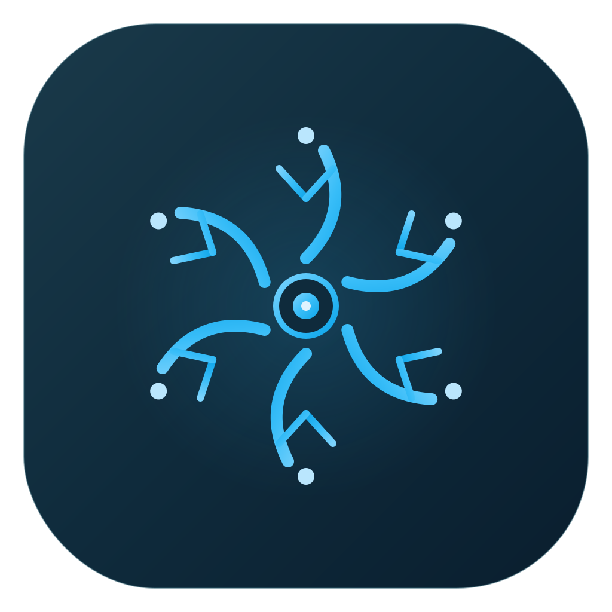
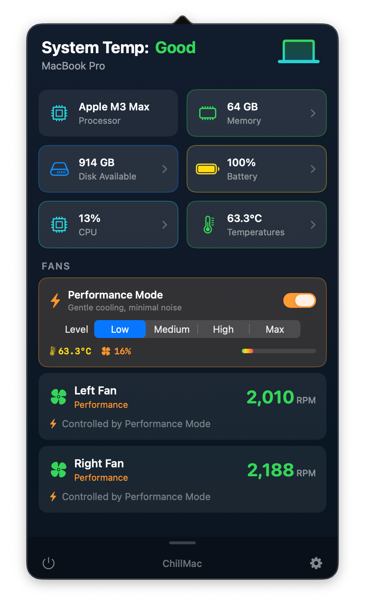
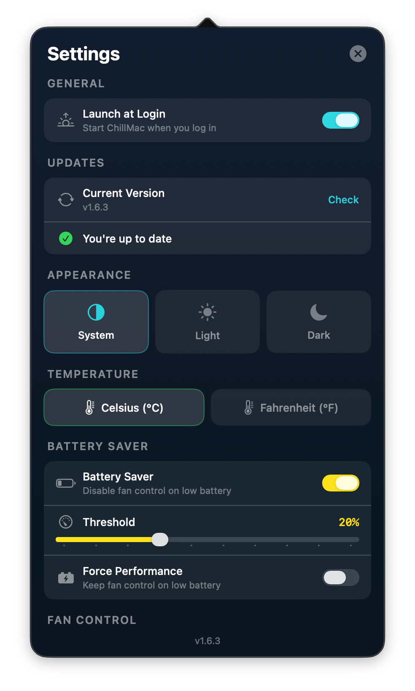
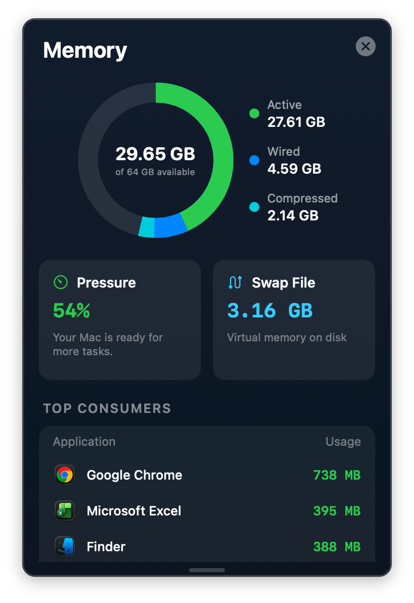
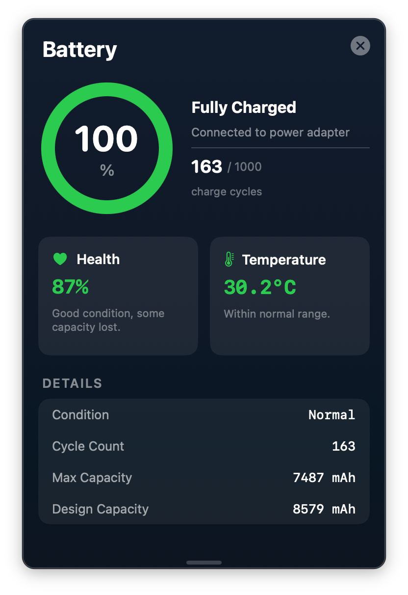
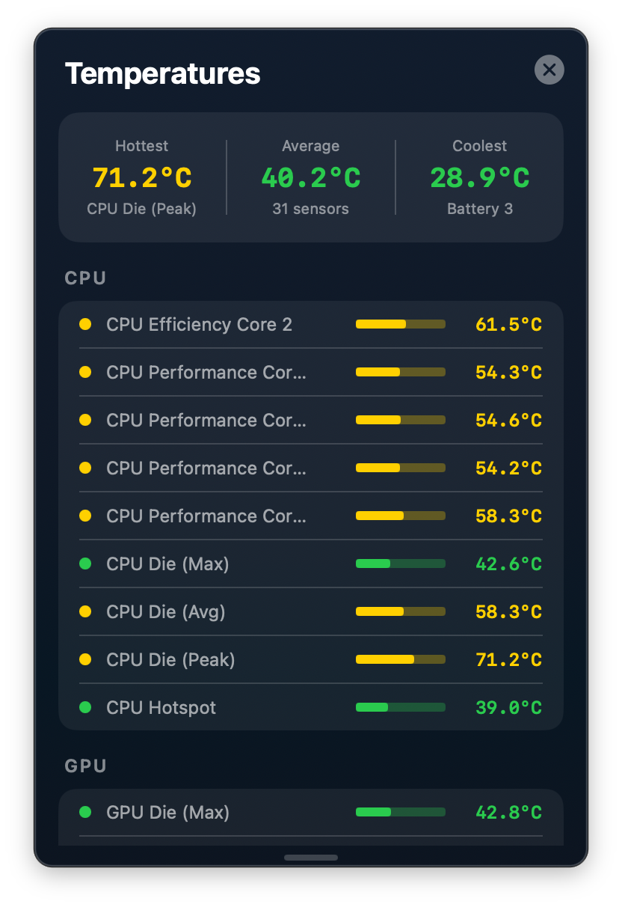

<p align="center">
  
</p>

# ChillMac

A free, open-source macOS menu bar app for monitoring your system and controlling fan speeds. Keep your Mac chilly.

**[Download the latest release](https://github.com/idevtim/chillmac/releases/latest)**

## Screenshots

<p align="center">
  
  
</p>

<p align="center">
  
  
  
</p>

## Features

- **Fan Control** — Live RPM display in the menu bar with per-fan manual speed sliders
- **Performance Mode** — Automatic fan curves with Low/Medium/High/Max presets
- **CPU Monitor** — Real-time usage graph, top consuming apps, temperature, and uptime
- **Memory Monitor** — Usage breakdown with donut chart, pressure, swap, and top consumers
- **Battery Monitor** — Charge gauge, health percentage, cycle count, and temperature
- **Disk Monitor** — Storage breakdown by category with SSD temperature
- **Temperature Sensors** — Color-coded readings for CPU, GPU, memory, SSD, battery, and more
- **Auto-Update** — Checks for new releases from GitHub and notifies you in-app
- Apple Silicon and Intel Mac support

## Install

### Download (recommended)

1. Grab `ChillMac.dmg` from the [latest release](https://github.com/idevtim/chillmac/releases/latest)
2. Open the DMG and drag ChillMac to Applications
3. Launch ChillMac — it'll appear in your menu bar
4. On first launch, you'll be prompted for admin credentials to install the fan control helper

The DMG is signed, notarized, and stapled by Apple — Gatekeeper will let it through.

### Build from source

**Requirements:**
- macOS 13.0+
- Xcode 15+
- [XcodeGen](https://github.com/yonaskolb/XcodeGen) (`brew install xcodegen`)

```bash
git clone https://github.com/idevtim/chillmac.git
cd chillmac
xcodegen generate
xcodebuild -project ChillMac.xcodeproj -scheme ChillMac build
```

Or open `ChillMac.xcodeproj` in Xcode and hit Run.

> **Note:** Debug builds skip the helper's code signature check, so the privileged helper works without matching the original signing identity. You can build, run, and hack on ChillMac with your own (or no) Developer ID.

## How It Works

Two-process architecture with privilege separation:

```
Menu Bar App (UI + read-only SMC) ──XPC──> Helper Daemon (root, write SMC)
```

- **Main app** (unprivileged) — Reads SMC sensors every 2 seconds and displays a SwiftUI popover with system dashboards.
- **Helper daemon** (root) — Installed via `SMAppService`, handles fan speed/mode writes over XPC. Validates the caller's code signature before accepting connections.

On Apple Silicon, the helper manages SMC test mode to bypass `thermalmonitord` for manual fan control. Signal handlers ensure cleanup if the helper exits unexpectedly. Fans always reset to automatic mode on app launch and quit.

## Contributing

Contributions are welcome! Fork the repo, make your changes, and open a PR.

```bash
# Fork and clone
git clone https://github.com/YOUR_USERNAME/chillmac.git
cd chillmac

# Set up
brew install xcodegen
xcodegen generate

# Build and run from Xcode, or:
xcodebuild -project ChillMac.xcodeproj -scheme ChillMac build
```

There's no test suite — testing is done manually via the UI. If you're adding a feature, just make sure the app builds and the feature works as expected.

## Project Structure

```
ChillMac/
  App/              Entry point, status bar controller, settings, update checker
  Views/            SwiftUI views (dashboard, fan controls, detail panels, settings)
  Fan/              Data models and monitoring engines (CPU, memory, battery, disk)
  SMC/              IOKit bridge to Apple SMC driver
  XPC/              Helper connection and installation
FanControlHelper/   Privileged helper daemon (runs as root)
Shared/             XPC protocol shared between app and helper
scripts/            Build and release tooling
```

## License

MIT — see [LICENSE](LICENSE) for details.
