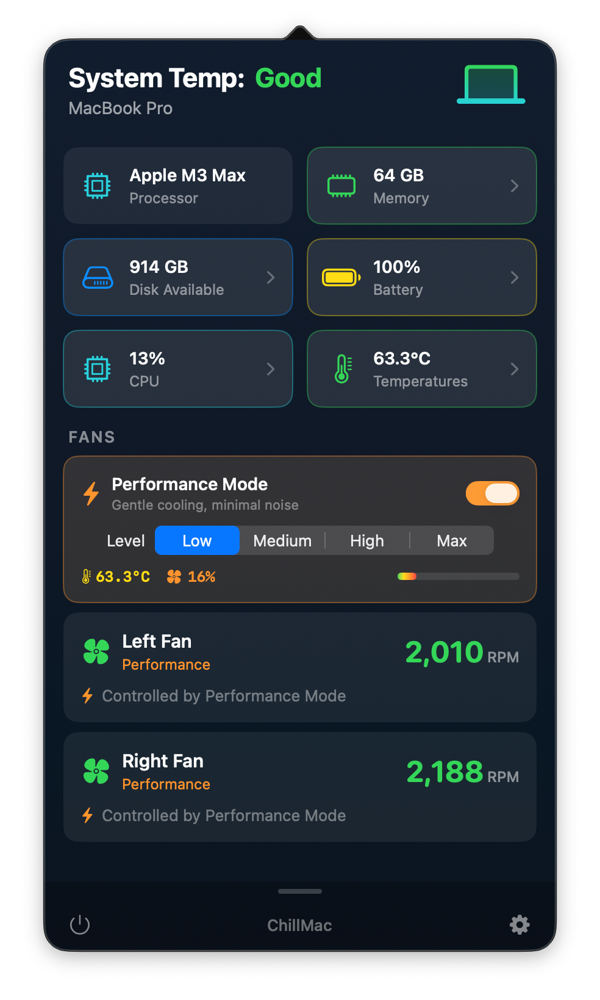
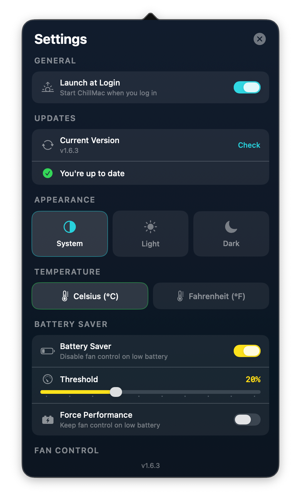
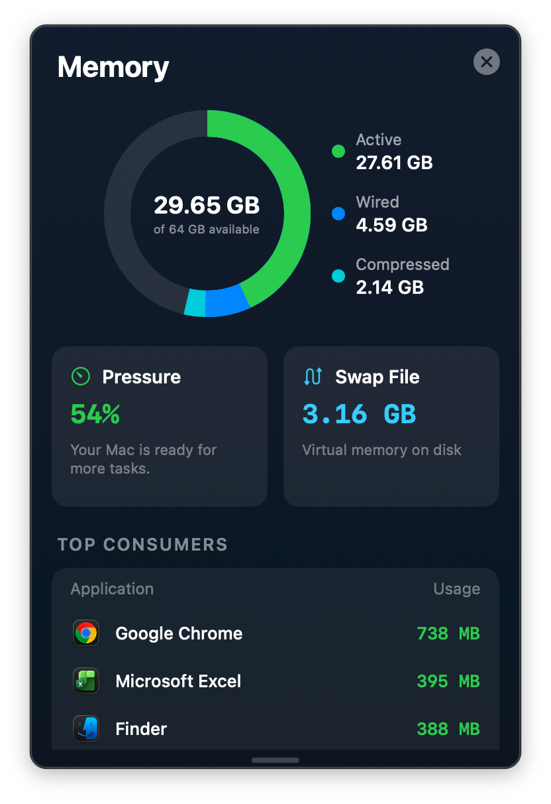
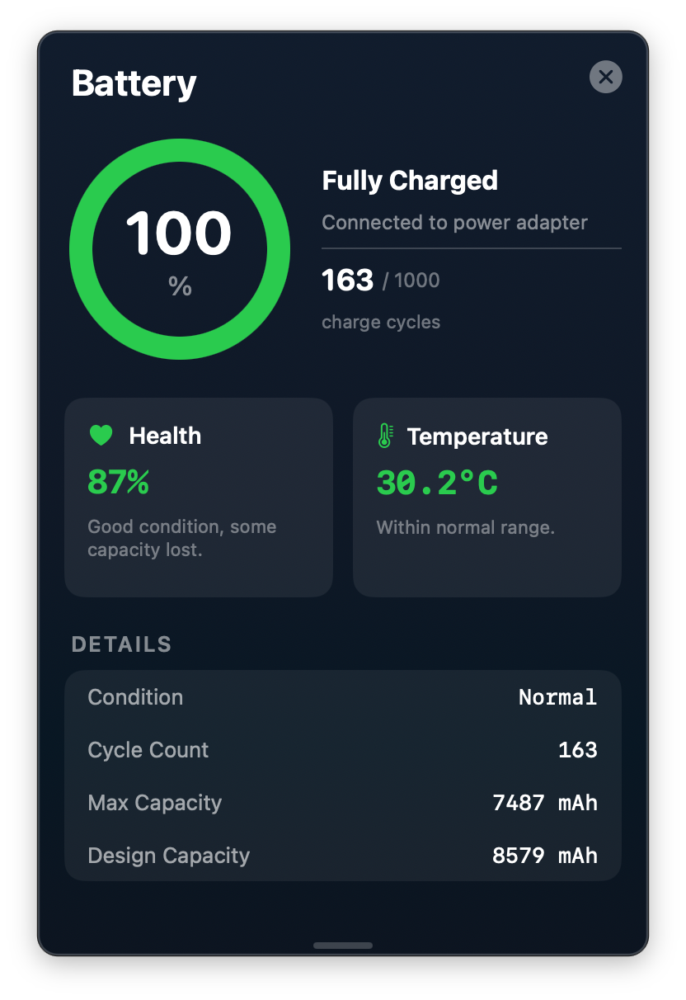
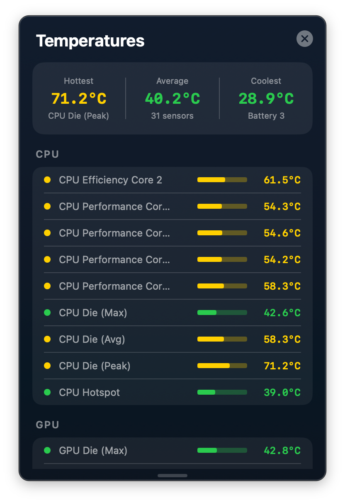

<p align="center">
  
</p>

# Fan Sooner

A free, open-source macOS menu bar app for monitoring your system and controlling fan speeds. Keep your Mac chilly.

**[Download the latest release](https://github.com/idevtim/chillmac/releases/latest)**

## Screenshots

<p align="center">
  
  
</p>

<p align="center">
  
  
  
</p>

## Features

- **Fan Control** — Live RPM display in the menu bar with per-fan manual speed sliders
- **Performance Mode** — Automatic fan curves with Low/Medium/High/Max/Ultra presets (Ultra = pure performance curve, not constant full blast)
- **CPU Monitor** — Real-time usage graph, top consuming apps, temperature, and uptime
- **Memory Monitor** — Usage breakdown with donut chart, pressure, swap, and top consumers
- **Battery Monitor** — Charge gauge, health percentage, cycle count, and temperature
- **Disk Monitor** — Storage breakdown by category with SSD temperature
- **Temperature Sensors** — Color-coded readings for CPU, GPU, memory, SSD, battery, and more
- **Auto-Update** — Checks for new releases from GitHub and notifies you in-app
- Apple Silicon and Intel Mac support

## Install

### Download (recommended)

1. Grab `Fan Sooner.dmg` from the [latest release](https://github.com/idevtim/chillmac/releases/latest)
2. Open the DMG and drag **Fan Sooner** into **Applications** (not Desktop or Downloads)
3. Launch Fan Sooner — it appears in the menu bar
4. On first launch, approve it under **System Settings → General → Login Items** (Allow in the Background) so the fan-control helper can run
5. Settings → Helper should show **Ready** before Max / Ultra will change fan speeds

The DMG is signed, notarized, and stapled — Gatekeeper will let it through. Fan writes need that notarized helper; a dragged Debug build will not.

### Build from source

**Requirements:**
- macOS 13.0+
- Xcode 15+
- [XcodeGen](https://github.com/yonaskolb/XcodeGen) (`brew install xcodegen`)

```bash
git clone https://github.com/idevtim/chillmac.git
cd chillmac
xcodegen generate
open ChillMac.xcodeproj   # ⌘R for day-to-day UI work
```

Or:

```bash
xcodebuild -project ChillMac.xcodeproj -scheme ChillMac -configuration Debug build
```

**What Debug vs Release is for**

| Goal | How |
|------|-----|
| Menu bar UI, sensors, Native Cool | Xcode Debug / adhoc Run is fine |
| Max / Ultra fan control on a real install | Notarized Release app in `/Applications` (`./scripts/build-dmg.sh`) |

Copying a Debug `Fan Sooner.app` into `/Applications` looks installed but the privileged helper usually fails to spawn (`EX_CONFIG` / launch constraints). Use the release pipeline (or an equivalent Developer ID sign → notarize → staple) and approve Login Items once.

**Release / local notarized install**

```bash
cp .env.example .env   # APPLE_ID, APPLE_APP_SPECIFIC_PASSWORD, APPLE_TEAM_ID
# Optional: APPLE_SIGNING_NAME="Your Name" if not Tim Murphy
brew install create-dmg
./scripts/build-dmg.sh
# Install from build/Fan Sooner.dmg → /Applications, launch, approve Login Items
```

Helper health check:

```bash
launchctl print system/com.idevtim.ChillMac.Helper3 | rg 'state =|pid ='
```

If Helper stays “Not ready” after an upgrade: use in-app **Install Helper**, or as a last resort `sudo sfltool resetbtm` and reboot (resets all third-party Login Items approvals).

## How It Works

Two-process architecture with privilege separation:

```
Menu Bar App (UI + read-only SMC) ──XPC──> Helper Daemon (root, write SMC)
```

- **Main app** (unprivileged) — Reads SMC sensors every 2 seconds and displays a SwiftUI popover with system dashboards.
- **Helper daemon** (root) — Registered via `SMAppService` from `Contents/Library/LaunchDaemons/…Helper3.plist`, binary at `Contents/Library/HelperTools/`. Handles fan speed/mode writes over XPC. Validates the caller's code signature before accepting connections (relaxed in Debug).

On Apple Silicon, the helper manages SMC test mode to bypass `thermalmonitord` for manual fan control. Signal handlers ensure cleanup if the helper exits unexpectedly. Fans always reset to automatic mode on app launch and quit.

## Contributing

Contributions are welcome! Fork the repo, make your changes, and open a PR.

```bash
# Fork and clone
git clone https://github.com/YOUR_USERNAME/chillmac.git
cd chillmac

# Set up
brew install xcodegen
xcodegen generate

# Build and run from Xcode, or:
xcodebuild -project ChillMac.xcodeproj -scheme ChillMac build

# Unit tests (Swift Testing)
xcodegen generate && xcodebuild -project ChillMac.xcodeproj -scheme ChillMac -destination 'platform=macOS' test
```

For Max/Ultra changes, also verify a notarized `/Applications` install (see Install above). Agents: see `AGENTS.md` → **Getting started**.

## Project Structure

```
ChillMac/
  App/              Entry point, status bar controller, settings, update checker
  Views/            SwiftUI views (dashboard, fan controls, detail panels, settings)
  Fan/              Data models and monitoring engines (CPU, memory, battery, disk)
  SMC/              IOKit bridge to Apple SMC driver
  XPC/              Helper connection and installation
FanControlHelper/   Privileged helper daemon (runs as root)
Shared/             XPC protocol shared between app and helper
scripts/            Build and release tooling
```

## License

MIT — see [LICENSE](LICENSE) for details.
